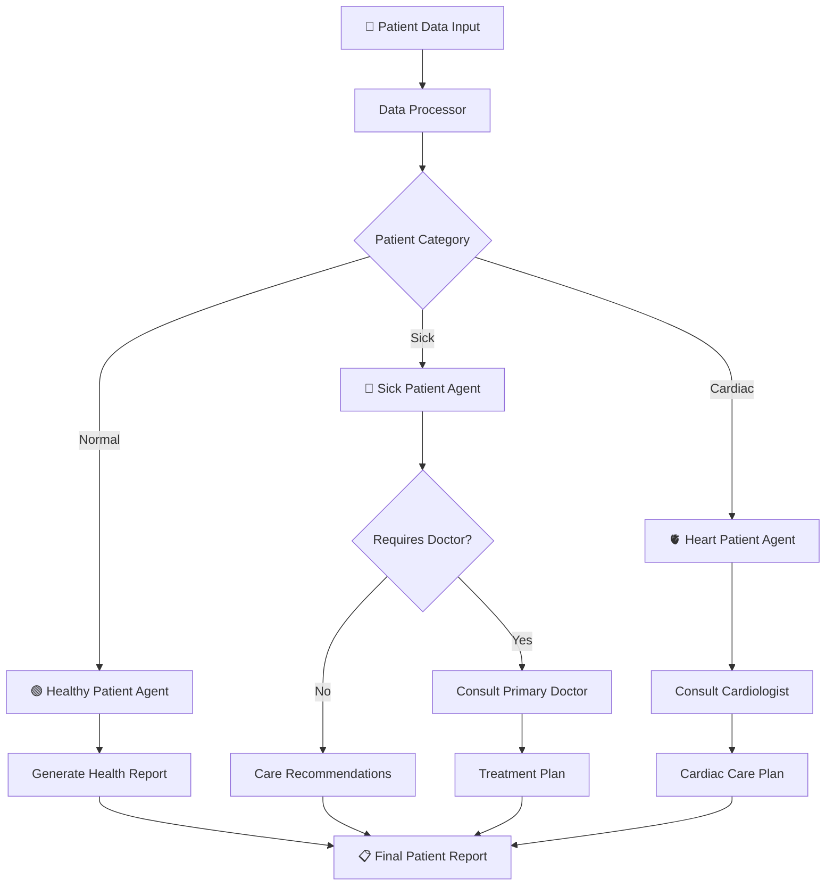
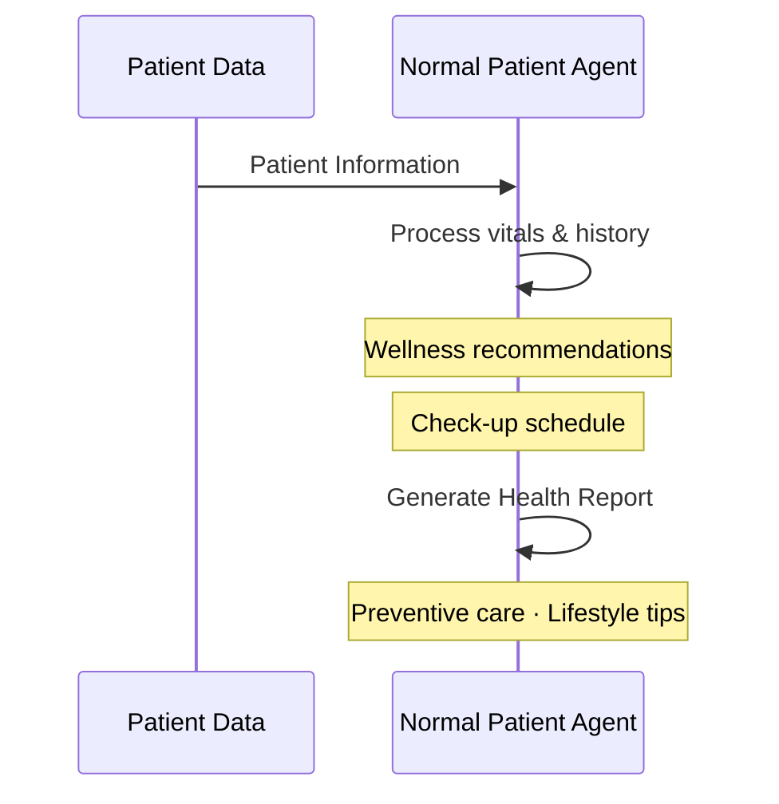
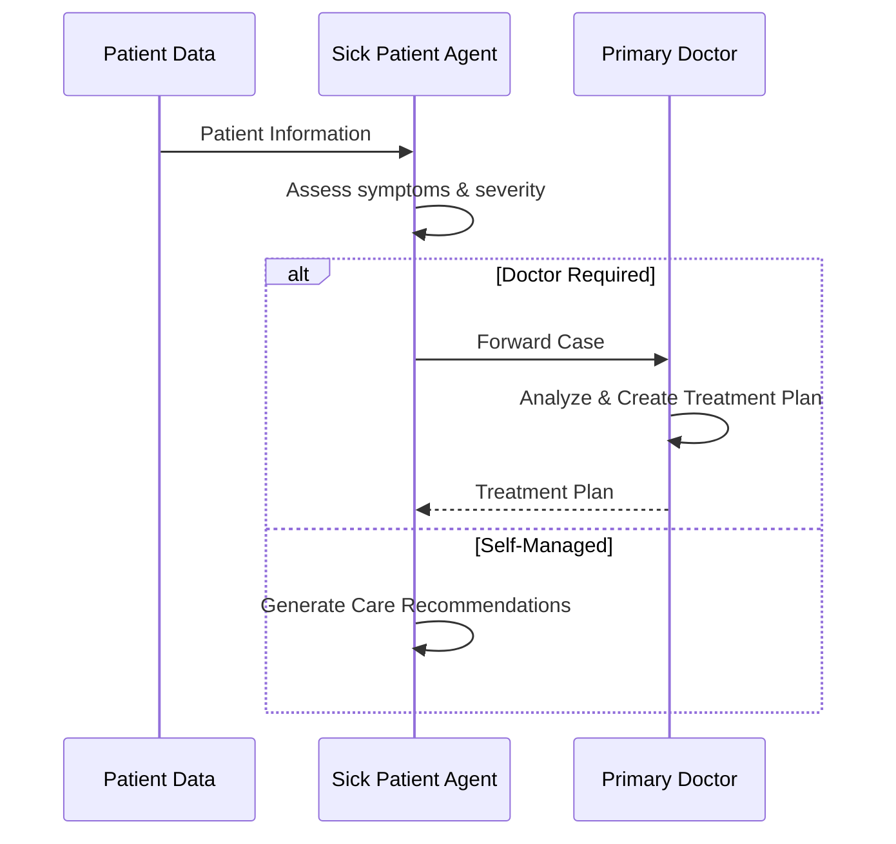
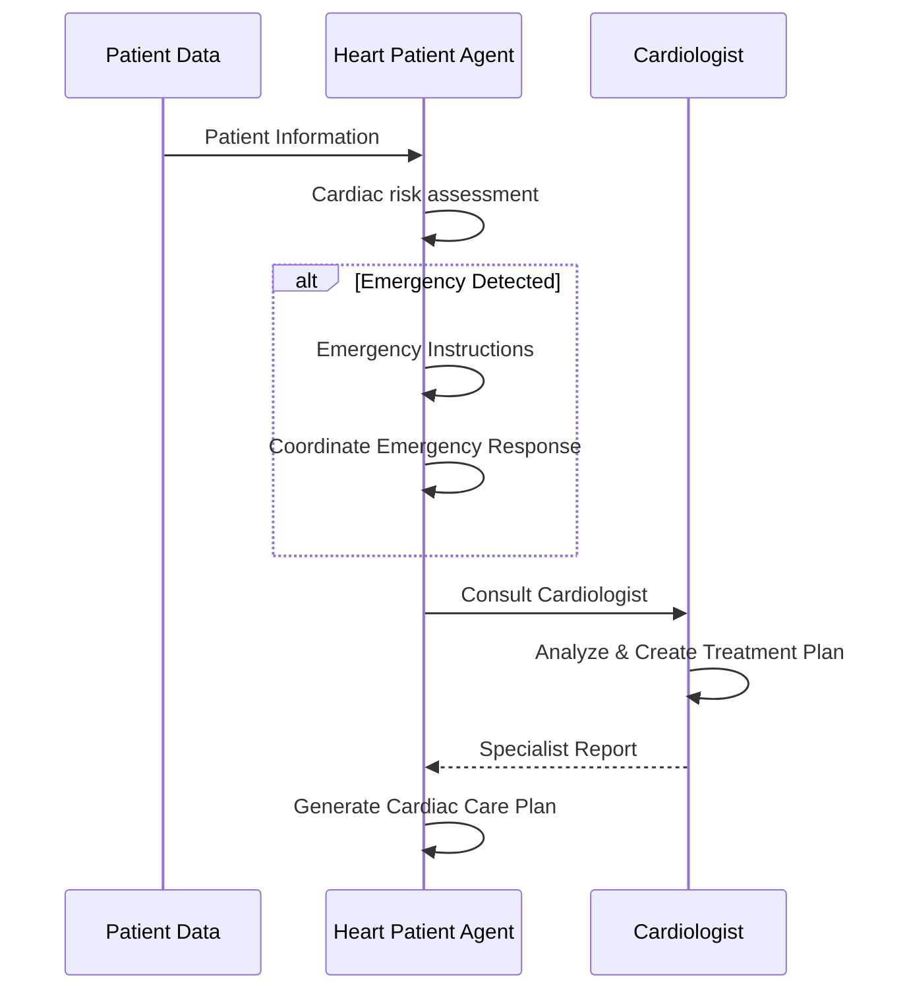

<div align="center">


# 🏥 Agentic Doctor System

**A multiagent AI system that processes patient data, routes cases intelligently across specialized agents, and coordinates doctor consultations to deliver personalized care plans — automatically.**

<br/>

[](https://python.org)
[](https://groq.com)
[](./LICENSE)
[]()

</div>

---

## 🌿 What Is This?

The **Agentic Doctor System** is a modular, multiagent AI architecture designed to simulate intelligent patient triage and care coordination. Given a patient's vitals, symptoms, and medical history, the system:

1. **Categorizes** the patient (normal, sick, or cardiac)
2. **Routes** them to a specialized AI agent
3. **Consults** the appropriate doctor agent when needed
4. **Generates** a detailed, structured care report in markdown

> This project demonstrates real-world agentic AI design patterns — orchestration, specialization, conditional escalation, and structured output generation.

---

## ✨ Features

| Feature | Description |
|---|---|
| 🤖 **Specialized Agents** | Dedicated agents for normal, sick, and cardiac patients with tailored logic |
| 🔀 **Smart Routing** | Auto-categorizes patients and assigns them without manual intervention |
| 🚨 **Emergency Detection** | Cardiac patients are screened for emergencies with immediate response coordination |
| 💬 **Agent Conversations** | Automated multi-turn dialogue between patient agents and doctor agents |
| ⚡ **Groq API** | Fast LLM inference for clinical reasoning and natural language generation |
| 📄 **Report Generation** | Structured markdown reports saved per patient to the `output/` directory |

---

## 🗺️ System Architecture

### Patient Routing Overview



### Categorization Logic

| Category | Trigger Conditions |
|---|---|
| 🟢 **Normal** | No significant symptoms · Normal vital signs |
| 🤒 **Sick** | Symptoms + abnormal vitals · OR more than 2 symptoms |
| 🫀 **Cardiac** | Cardiac symptoms (chest pain, shortness of breath, etc.) · OR cardiac history |

---

## 🔬 Agent Flows in Detail

### 🟢 Healthy Patient



### 🤒 Sick Patient



### 🫀 Cardiac Patient



---

## 🧪 Sample Patient Cases

| Patient | Category | Agent Path | Output |
|---|---|---|---|
| John Smith | 🟢 Normal | DataProcessor → NormalAgent | Wellness plan, check-up schedule |
| Emily Johnson | 🤒 Sick | DataProcessor → SickAgent → Doctor | Treatment plan (fever, cough, fatigue) |
| Robert Davis | 🫀 Cardiac | DataProcessor → HeartAgent → Cardiologist | Cardiac care plan with monitoring |
| Margaret Wilson | 🚨 Emergency | DataProcessor → HeartAgent → 🚨 → Cardiologist | Emergency response + urgent care plan |

---

## 🚀 Getting Started

### Prerequisites

- Python 3.10+
- A [Groq API key](https://groq.com)

### Installation

```bash
# 1. Clone the repository
git clone https://github.com/your-username/agentic-doctor-system.git
cd agentic-doctor-system

# 2. Install dependencies
pip install -r requirements.txt

# 3. Configure environment
cp .env.example .env
# → Open .env and add your GROQ_API_KEY

# 4. Run the system
python main.py
```

Reports are automatically saved as `.md` files inside the `output/` directory.

---

## 🗂️ Project Structure

```
agentic-doctor-system/
│
├── agents/                     # All agent implementations
│   ├── base_agent.py           # Shared base class for all agents
│   ├── doctor_agent.py         # Primary doctor & cardiologist agents
│   └── patient_agents/
│       ├── normal_agent.py     # Handles normal (healthy) patients
│       ├── sick_agent.py       # Handles symptomatic patients
│       └── heart_agent.py      # Handles cardiac patients + emergencies
│
├── data/
│   └── patient_records.py      # Sample fictional patient records
│
├── utils/
│   ├── config.py               # Environment & model configuration
│   └── data_processor.py       # Patient categorization logic
│
├── output/                     # Generated patient reports (auto-created)
├── main.py                     # Entry point — runs all patient flows
├── requirements.txt
└── .env.example                # Environment variable template
```

---

## 🧠 Design Patterns Used

This project deliberately showcases key agentic AI engineering concepts:

- **Orchestrator–Subagent Pattern** — `DataProcessor` orchestrates routing; agents operate independently
- **Conditional Escalation** — Sick agents escalate to doctors only when thresholds are met
- **Specialist Delegation** — Cardiac patients are always escalated to a domain-specific agent (Cardiologist)
- **Structured Output** — Each agent produces consistent, parseable markdown reports
- **Stateful Memory** — Each agent maintains conversation context across multi-turn interactions

---

## 💡 Why This Matters

AI-driven triage and care coordination is one of the most promising applications of LLM-powered agents. This project explores how:

- Multi-agent systems can mirror real clinical workflows
- LLMs can reason about patient data and generate actionable recommendations
- Escalation logic can be built without hard-coded rules — using agent judgment
- Structured AI outputs can integrate cleanly into real healthcare pipelines

> *"The goal isn't to replace doctors — it's to make sure every patient gets to the right one, faster."*

---

## 🙏 Acknowledgments

Sincere gratitude to **Youssef Barketallah Baklouti**
([youssef_barketallah.baklouti@alight.eu](mailto:youssef_barketallah.baklouti@alight.eu))
for his continuous guidance, valuable feedback, and unwavering support throughout the development of this project.

---

## ⚠️ Disclaimer

All patient data in this project is **entirely fictional** and generated for demonstration purposes only. No real medical records or personal health information are used or represented.

---

## 📄 License

MIT © [Houssem Eddine](https://github.com/HoussemDs)

---

<div align="center">


</div>
