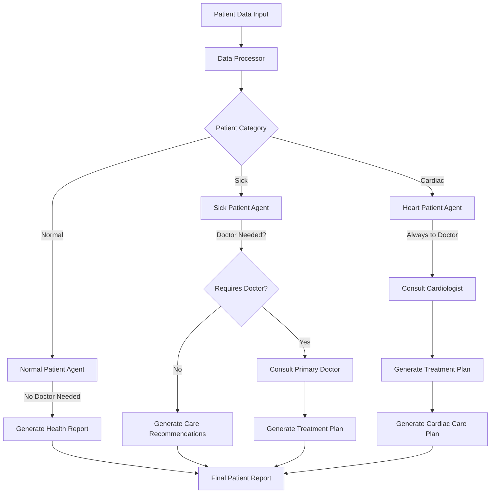
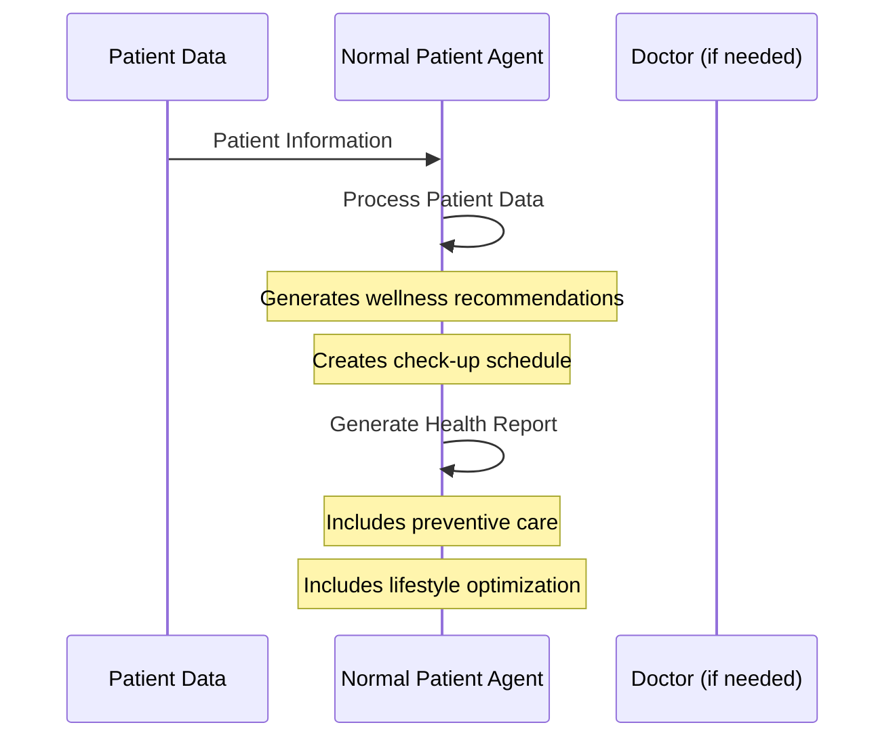
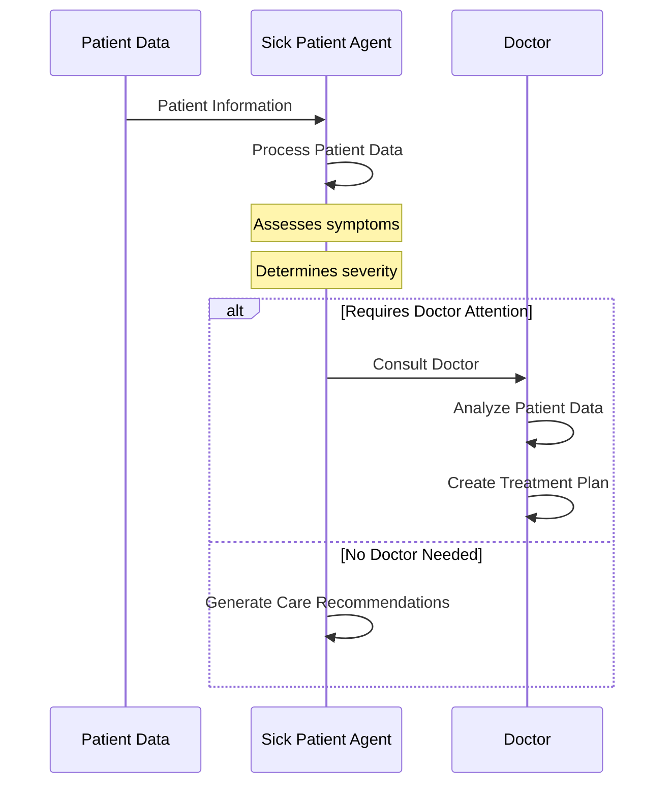
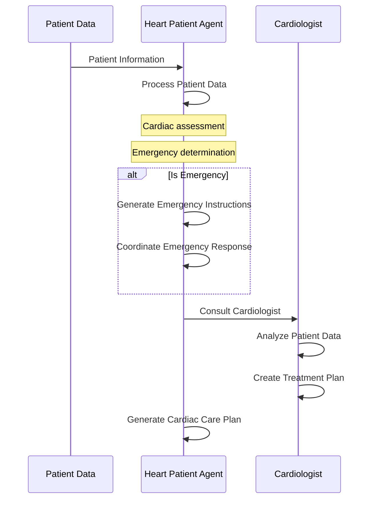

# Agentic Doctor System: Patient Flow Explanation

This document explains how patients flow through the Agentic Doctor System, including the interactions between different agents and the decision-making process.

## System Overview

The Agentic Doctor System uses multiple specialized AI agents to process patient data and provide appropriate medical care recommendations. Each agent has a specific role in the patient care workflow.

## Detailed Patient Flow

### 1. Initial Data Processing

- **Input**: Patient data (name, age, gender, vital signs, symptoms, medical history)
- **Process**: `DataProcessor` validates and categorizes the patient
- **Output**: Patient category (normal, sick, or cardiac)

### 2. Patient Categorization Logic

The system categorizes patients based on the following criteria:

- **Cardiac Patient**: 
  - Has cardiac symptoms (chest pain, shortness of breath, etc.)
  - OR has heart-related medical history

- **Sick Patient**:
  - Has symptoms AND abnormal vital signs
  - OR has more than 2 symptoms

- **Normal Patient**:
  - No significant symptoms
  - Normal vital signs

### 3. Agent Assignment

Based on the category, the patient is assigned to a specialized agent:

- **Normal Patient** → `NormalPatientAgent`
- **Sick Patient** → `SickPatientAgent`
- **Cardiac Patient** → `HeartPatientAgent`

### 4. Patient Processing by Agent Type

#### Normal Patient Flow

#### Sick Patient Flow

#### Cardiac Patient Flow

### 5. Doctor Consultation Process

When a patient requires doctor attention:

1. The patient agent forwards the case to the appropriate specialist:
   - Normal/Sick patients → Primary Care Doctor
   - Cardiac patients → Cardiologist

2. The doctor agent:
   - Analyzes patient data
   - Provides a medical assessment
   - Creates a treatment plan

3. For cardiac patients, additional steps occur:
   - The Heart Patient Agent generates a specialized cardiac care plan
   - In emergency cases, emergency instructions and response coordination are provided

### 6. Output Generation

The system generates a comprehensive markdown report for each patient that includes:

- Patient information and category
- Agent assessment
- Doctor consultation (if applicable)
- Treatment plan (if applicable)
- Specialized care plans (for cardiac patients)
- Health reports (for normal patients)
- Care recommendations (for sick patients not requiring doctor attention)

## Sample Patient Examples

### John Smith (Normal Patient)

- **Flow**: Patient Data → DataProcessor → NormalPatientAgent → Health Report
- **Key Actions**: Wellness recommendations, preventive care, check-up schedule
- **Output**: Health report with lifestyle optimization suggestions

### Emily Johnson (Sick Patient)

- **Flow**: Patient Data → DataProcessor → SickPatientAgent → Doctor → Treatment Plan
- **Key Actions**: Symptom assessment, doctor consultation, treatment planning
- **Output**: Treatment plan addressing fever, cough, and other symptoms

### Robert Davis (Cardiac Patient)

- **Flow**: Patient Data → DataProcessor → HeartPatientAgent → Cardiologist → Treatment Plan → Cardiac Care Plan
- **Key Actions**: Cardiac assessment, cardiologist consultation, specialized care planning
- **Output**: Comprehensive cardiac care plan with monitoring recommendations

### Margaret Wilson (Emergency Cardiac Patient)

- **Flow**: Patient Data → DataProcessor → HeartPatientAgent → Emergency Response → Cardiologist → Treatment Plan → Cardiac Care Plan
- **Key Actions**: Emergency instructions, emergency response coordination, urgent care planning
- **Output**: Emergency cardiac care plan with immediate action steps

## Agent Communication

Agents communicate through structured data and text responses:

1. Patient agents process raw patient data and generate assessments
2. Doctor agents receive patient assessments and generate medical recommendations
3. Specialized agents (like the Heart Patient Agent) can request consultations from specialists

Each agent maintains its own memory of interactions, allowing for contextual understanding throughout the patient care process.

## Conclusion

The Agentic Doctor System provides a comprehensive approach to patient care through specialized AI agents. By categorizing patients and routing them to appropriate agents, the system ensures that each patient receives the right level of care for their condition.